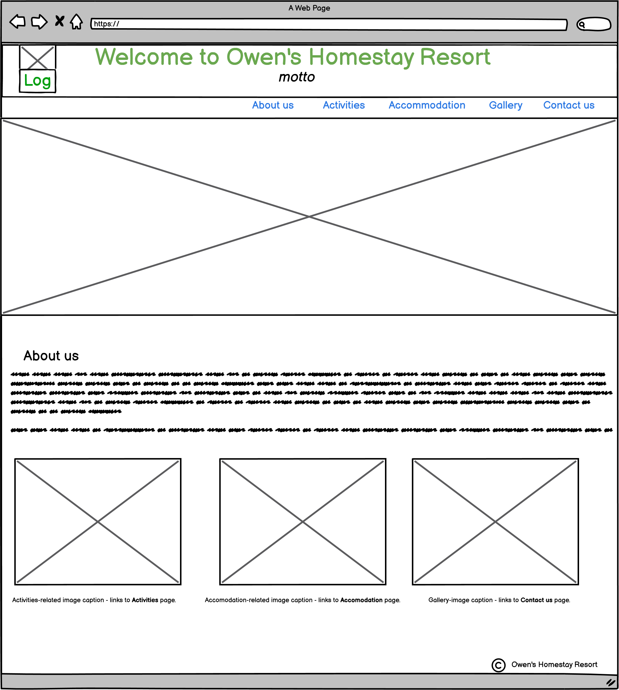
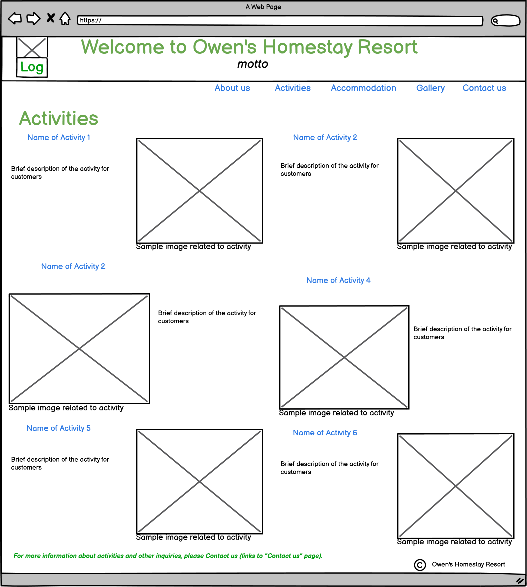
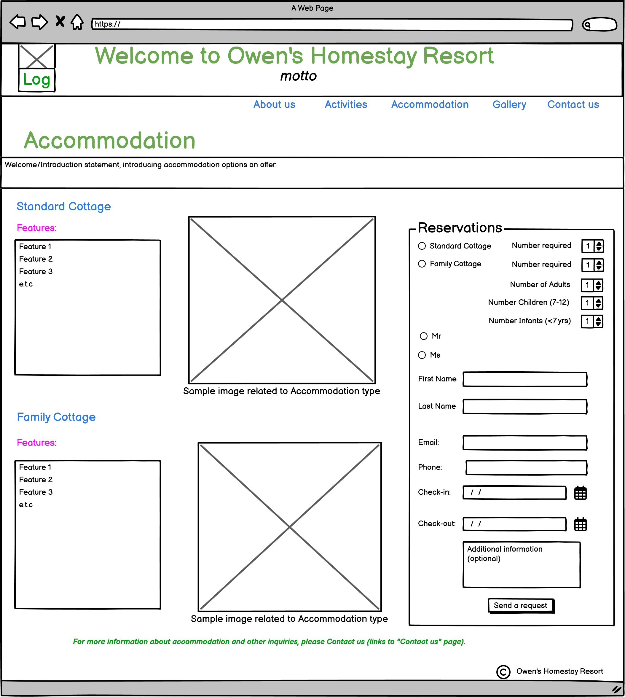
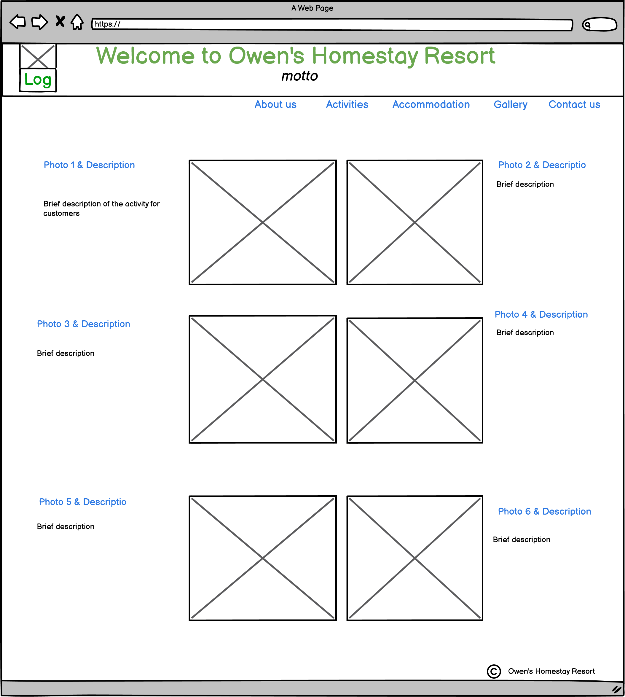
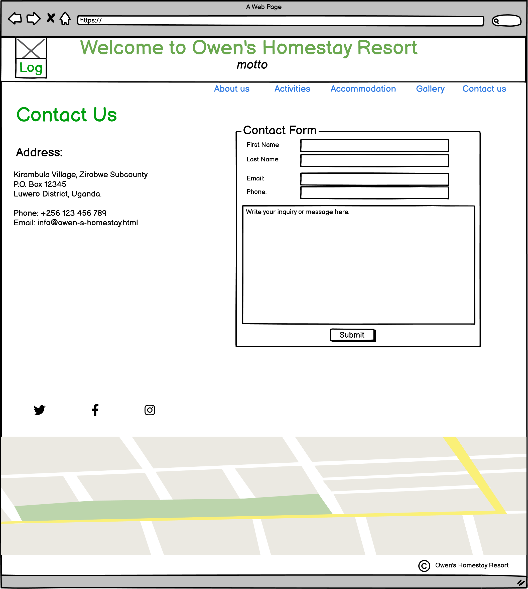

# Owen's Homestay Resort #

   

## Purpose of Project ##

This project is intended to be a static website,based on HTML and CSS only as part of my participation in the Diploma in Full Stack Software Development programme of Code Institute.

## Description ##

Owen's Home Stay Resort (OHR) is showcased as a home-away-from-home destination which offers a quiet and relaxation environment in family home setting. It is presented as an ideal coutryside get-away.Located on a 20 acre farm, OHR provides an opportunity for visitors to get involved in light work on the farm as part of their relaxation.  

## User stories ##

The following considerations of the user experience underly the design of the website:  
*A simple, less crowded website.  
*Clear concise messaging.  
*Compatibility with user's device.  
*Up to date information.  
*Provision for user feedback or inquiries.  

# UX/UI Design #

The structure of the website was created based on the following wireframes crated with Balsamic Wireframes:  

## Home Page ##

Wireframe for Home Page.
   
  
## Activities Page ##

Wireframe for Activites Page.

## Accommodation Page ##  

Wireframe for Accommodation Page.
  

## Gallery Page ##

Wireframe for Gallery Page.
  

## Contact Page ##

Wireframe for Contact Page.
  
