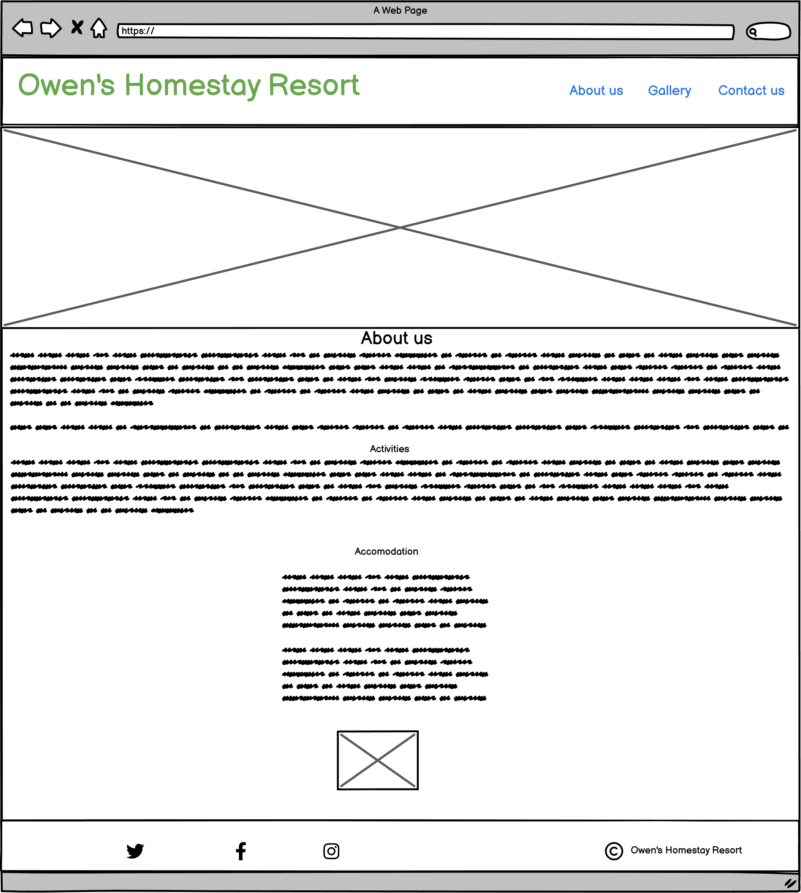

# Owen's Homestay Resort #

   

## Purpose of Project ##

This project is intended to be a static website,based on HTML and CSS only as part of my participation in the Diploma in Full Stack Software Development programme of Code Institute.

## Description ##

Owen's Home Stay Resort (OHR) is showcased as a home-away-from-home destination which offers a quiet and relaxation environment in family home setting. It is presented as an ideal coutryside get-away.Located on a 20 acre farm, OHR provides an opportunity for visitors to get involved in light work on the farm as part of their relaxation.  

# UX/UI Design #

## User stories ##

The following considerations of the user experience underly the design of the website:  
*A simple and easily navigable, less crowded website.  
*Clear concise messaging.  
*Compatibility with user's device.  
*Visually appealing, with a calming and refreshing feel, consistent with the theme of the website.  
*Provision for user-feedback or inquiries.  

## Structure ##

The structure of the website was created based on the following wireframes crated with Balsamic Wireframes:  

## Home Page ##

This pae briefly inroduces Owen's Homestay Resort and lists offerings for the user to know what they can expect.
It is based on this wireframe:

Wireframe for Home Page.
  

## Gallery Page ##

The galery contains sample pictures of possible activities and farm products that could be enjoyed while at the Resort. It is a collection of pictures that are designed to be responsive to various viewing gadgets.

Wireframe for Gallery Page.
  

## Contact Page ##

Telephone, email social media links and a feedback form have been assigned to the "Contact" page for convenient interaction with the user.

Wireframe for Contact Page.
  

## Responsive Design ##

The website has been optimised for responsive display on mobile phones, tablets, labtops and large screens, as exemplified in the images here:

  

  

## Design themes fonts. ##

