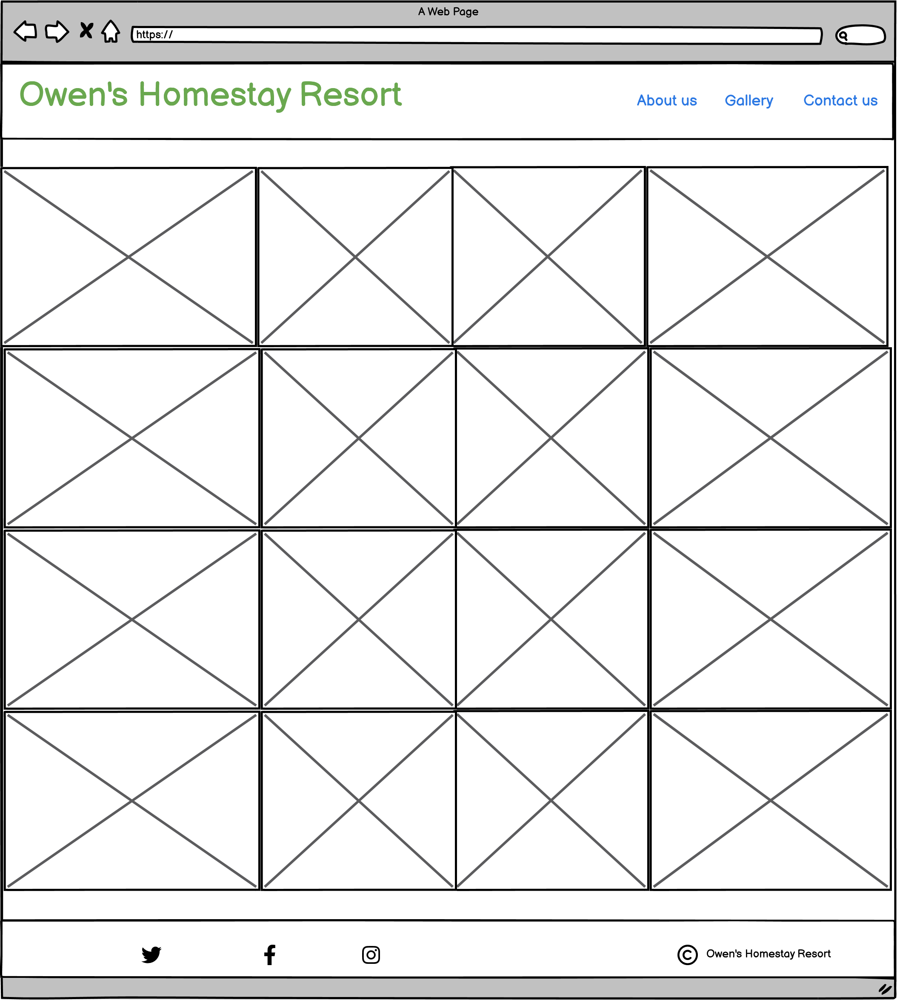
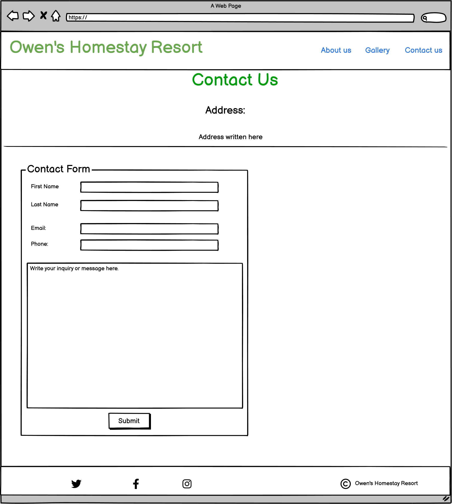

# Owen's Homestay Resort #

## Purpose of Project ##

This project is intended to be a static website,based on HTML and CSS only as part of my participation in the Diploma in Full Stack Software Development programme of Code Institute.

## Description ##

Owen's Home Stay Resort (OHR) is showcased as a home-away-from-home destination which offers a quiet and relaxation environment in family home setting. It is presented as an ideal coutryside get-away.Located on a 20 acre farm, OHR provides an opportunity for visitors to get involved in light work on the farm as part of their relaxation.  

The live site is available [here](https://kenarina.github.io/Owens-Homestay-Resort/)

# UX/UI Design #

## User stories ##

The following considerations of the user experience underly the design of the website:  
*A simple and easily navigable, less crowded website.  
*Clear concise messaging.  
*Compatibility with user's device.  
*Visually appealing, with a calming and refreshing feel, consistent with the theme of the website.  
*Provision for user-feedback or inquiries.  

## Structure ##

The structure of the website was created based on the following wireframes crated with Balsamic Wireframes:  

## Home Page ##

This pae briefly inroduces Owen's Homestay Resort and lists offerings for the user to know what they can expect.
It is based on this wireframe:

Wireframe for Home Page.
  

## Gallery Page ##

The galery contains sample pictures of possible activities and farm products that could be enjoyed while at the Resort. It is a collection of pictures that are designed to be responsive to various viewing gadgets.

Wireframe for Gallery Page.
  

## Contact Page ##

Telephone, email social media links and a feedback form have been assigned to the "Contact" page for convenient interaction with the user.

Wireframe for Contact Page.
  

## Responsive Design ##

The website has been optimised for responsive display on mobile phones, tablets, labtops and large screens, as exemplified in the images here:

  

  

## Design themes fonts. ##  

The message from the website to the user is one of relaxation, a step away from the fast-paced "high octane" life of the city and work, to a place where they can recharge. The light shades of green, Teal and white exude a softness and  calming mood to the user. The text fonts, Open Sans and Oswald from [Google Fonts](https://fonts.google.com/) were preferred for this project. The text is easy on the eye.Images and and text were all used modestly to enhance the user experience. All images used in this project were previously taken personally. They were not outsourced externally.  

## Testing ##
Basic functionality to achieve desired disign outcomes were progressively done in an iterative process. The following tests were done manually during the coding process.  
*Functionality of internal links, including the navigation bar links.
*Functionality of external links.
*Form validation  

Verification of responsive desing. Google Chrome, Mozilla Firefox and Microsoft Edge were successfully used for this test.  

Automatic HTML checking and CSS validation were done using [Nu Html Checker](https://validator.w3.org/nu/). All errors and bad code were corrected and recheked until only external links such as from Google Fonts triggered warnings.  

One challenge that I still have even at submission is that I have not been able to dock the header such that scrolling of the main text upwards is not visible between the header and the browser bookmark or menu bar.  Everyhing else looks good at my stage of learning.

##  Technologies ##

[Codeanywhere](https://app.codeanywhere.com/) for HTML and CSS  
[Visual Studio Code](https://code.visualstudio.com/) desktop version for HTML and CSS  
[Google Fonts](https://fonts.google.com/) for fonts.  
[favicon.io](https://favicon.io/favicon-converter/) to generate the favicon.  
[COMPRESSORDIE](https://compress-or-die.com/) for web optimisation of images  
[FontAwesome](https://fontawesome.com/) for icons  
[Balsamiq](https://balsamiq.com/wireframes/) to make wireframes  
[GitHub](https://github.com/) to hosting source code, to deploy and host the website.  
[Git](https://git-scm.com/) for version control.  
Microsoft Powerpoint for merging images prior to web optimisation for the readme text.  

Other resources, including course material from Code Institute, were consulted from time to time. Examples include: [StackOverflow](https://stackoverflow.com/), [W3schools](https://www.w3schools.com/) and [TutorialRepublic](https://www.tutorialrepublic.com/). However, the course material from Code Institute was the primary resource.  

## Deployment ##

This project was deployed to GitHub pages and the site is up and running.

### Deployment procedure: ###

*Log into GitHub.  
*Select **Owens-Homestay-Resort** from the list of repositories.  
*Select Settings and next, on the left side down-menu, select pages.  
*Under Source, select main and the *default value /(root)*.  
*Press Save.  
*A notification for deployment will appear. Refresh the page, and the link to the deployed site will be available in a green sub-section on the top of the page.  
*Click on the link to go to the live deployed page.  

The live link can be found [here](https://kenarina.github.io/Owens-Homestay-Resort/).

### How to run this project Locally (I used VSCode) ###

**Clone the repository**  

*Navigate to the **Owens-Homestay-Resort** GitHub Repository.  
*Click the Code drop-down menu.  
*Click the HTTPS sub-heading under the Clone heading.  
*Copy the link.  
*Open VSCode.  
*Open a terminal in the directory of your choice, type git clone and paste the link.  
*A clone of the repository will now be created on your machine.  

## Acknowledgements ##

While I came up with the original idea for this project, I would not have brought it up to this stage had it not been for Ronan McClelland, my mentor on this journey. His wealth of experience and patience have been very inspirational.

